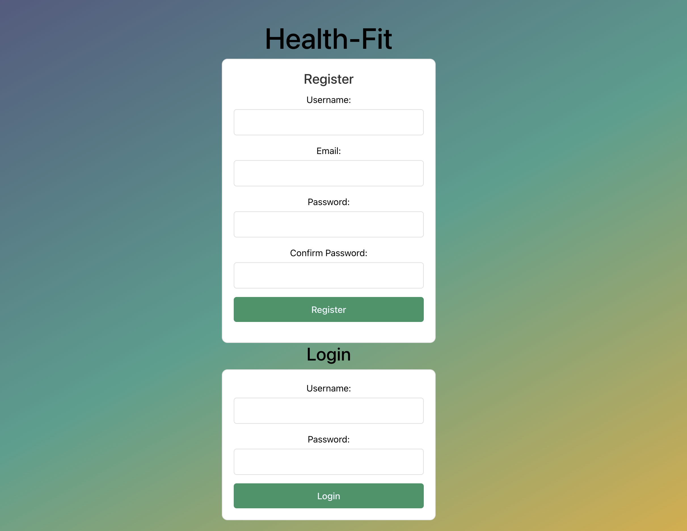
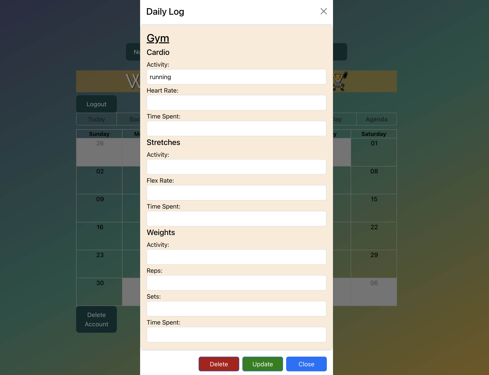
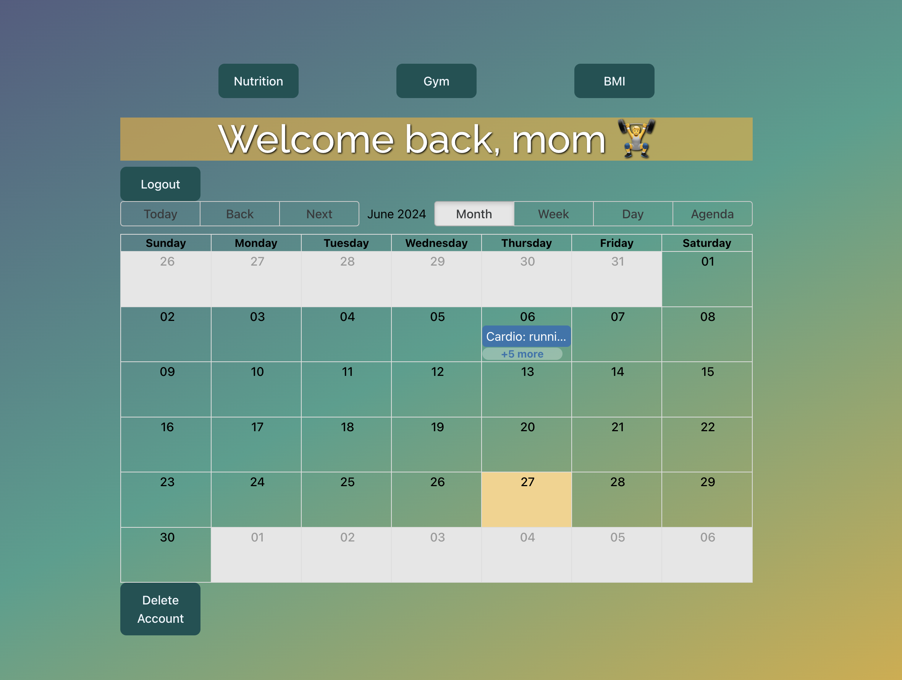

# Project Name: Health-Fit

### <u>Description:</u>

### Our web application HealthFit, will allow users to record, store, and manage their personal health intake and goals. Users can upload their daily intake, track their gym activities, set goals, and help them maintain a log of their personal fit life. The application will be integrated with a clean, responsive design. Users have the ability to view, create, update or delete any existing data or future data. 

## Technologies Used:
### <u>Frontend:</u>
#### Axios, CSS3 (Flexbox/Grid), HTML5, React.js, React Router, Vite
> Megan & Vladimir: Bootstrap, React-Bootstrap, React-Big-Calendar(Date-fns & DatePicker)
### <u>Middleware:</u>
#### Body-Parser, Morgan
> Sebastian: Express-Session
### <u>Backend:</u>
#### CORS, Express.js, MongoDB (Mongoose), Node.js
> Vladimir & Sebastian: Passport(Passport-Local & Passport-local-Mongoose)
### <u>Tools:</u>
#### Git, GitHub, Trello
> Megan: Lucid

## Project Setup:

### Backend Setup:
1. Create a new Github repository for the backend, add your group members as contributers and insert a ReadME.md.
2. Integrate our `MERN Stack` project (npm init), install necessary packages (express, mongoose, etc.).
3. Design 3 connected Mongoose models for our project.
4. Implement `CRUD` operations for both Front and Backend.
5. Create our `RESTful API` endpoints for Frontend and Backend interaction.
### Frontend Setup:
1. Create a new folder within our backend to house our Frontend.
2. Develop and organize components and routes for out React.js project.
3. Designed `UI Components` for modal display, forms (add/edit), and navigation.
4. Integrate `Axios` for our API calls to the Backend.
5. Implement CRUD functionalities.
### Integration:
1. Connected our Frontend and Backend using Axios to bring data from our Backend database to be displayed and updated on our Frontend.
2. Implemented `Password Authentication` for user handling and validation on both ends.
### Design and User Experience:
1. Created wireframes and design mockups using `Lucid`.
2. Implemented a responsive design and bootstrap.
3. Created easy usability and user interactive forms, buttons, and modals.
### Documentation and Deployment:
1. Created a detailed README.md with how the webpage was created and developed.
2. Included `ERD`, `Component Hierarchy Diagram`, and `Trello` board links.
3. Deploy frontend/backend applications.
4. Test and verify project deployment functionalities work.
### Project Management
1. Trello Board: Used Trello to organize thoughts, goals, and responsibilities for each team member. 
2. Set milestones and allocated tasks accordingly for frontend and backend development.
3. `GitHub` Workflow: Maintained individual branches by making meaningful commits for our merges to main for code review and pull requests.

## Wireframe & Diagram:
* [Lucid ERD/Component](https://lucid.app/lucidchart/685c5c43-f02e-400e-ad44-514a08ea487d/edit?viewport_loc=-33%2C-479%2C2219%2C1061%2C0_0&invitationId=inv_b93ec5cd-b833-4b7d-bb7b-fbe60882eec9)
* [Lucid Wireframe](https://lucid.app/lucidchart/a378afd9-b738-490a-b79a-ada9dcfa27f5/edit?viewport_loc=-480%2C-465%2C3898%2C1865%2C0_0&invitationId=inv_a89989df-38a3-4d55-b367-0897b8300be5)
* [Trello](https://trello.com/invite/b/6KR8gZOj/ATTI62d55b2303458b8e47dd5078081f2a3117C6BD45/health-fit-goal)

## Future Updates:
<input type="checkbox" checked> Create a function to log BMI

<input type="checkbox" checked> Make Scrollable Calendar
 
<input type="checkbox"> Integrate an outside API to log into Nutrition

<input type="checkbox"> Modify CSS to have a daymode & nightmode

## <u>Credits:<u>
| Vladimir Djelovski | Sebastian Cuellar | Megan Mashburn | Alfred Nedohon |
| -------- | -------- | -------- | -------- |
| Image Vlad | Image Sebastian | | Image Alfred |
| [GitHub](https://github.com/Vladimir1000) | [GitHub](https://github.com/sebcuellar6) |[GitHub](https://github.com/MyCloudAtl) | [GitHub](https://github.com/AlfredNedohon0317) |
| vladimir.dzelovski@gmail.com | seabasscuellarh@gmail.com | [LinkedIn](https://linkedin.com/in/megan-mashburn-075598194) | [LinkedIn](https://linkedin.com/in/alfred-nedohon-b71342221) |

